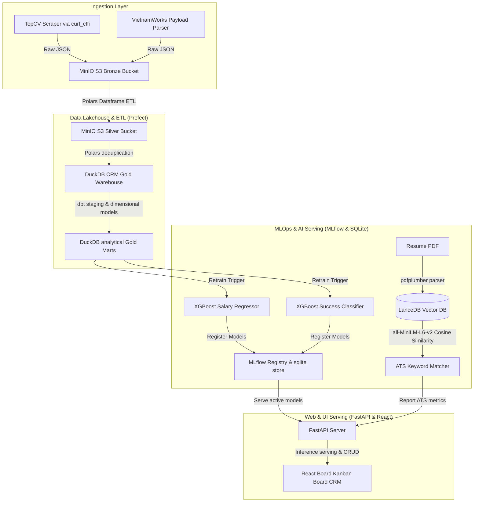

# 🌌 CareerFlow AI: Enterprise-Grade Job Market Data Lakehouse & MLOps Career CRM

**CareerFlow AI** is a production-grade, end-to-end Job Market Ingestion Lakehouse, MLOps pipeline, and Career CRM designed to optimize job search matching and automate mock interview practices. It showcases a modern data stack integration combining Cloud-Native S3 Storage, Prefect Orchestration, Polars ETL pipelines, dbt modeling, MLflow registries, XGBoost Serving, and a React + Vite interactive speech-dictated client interface.

---

## 🏗️ System Architecture



---

## 🌟 Core Technical Features

### 1. Medallion Parquet Data Lakehouse (DE)
* **Object Lake Storage**: Local cloud-native S3 MinIO storage holding raw scraped JSON streams under `s3://bronze/` and optimized, schema-enforced Parquet tables under `s3://silver/`.
* **Polars Pipeline ETL**: Custom Polars engine normalizing schema types, stripping string whitespaces, filtering outliers, and writing binary parquets.
* **dbt transformations**: Fully configured dbt profile connecting to DuckDB. Models a clean Star Schema (`stg_applications` staged views and `interview_marts` gold tables) by joining staging facts and dimensions.
* **Prefect Orchestration DAGs**: Streamlines execution across `etl_flow.py` and `ml_retrain_flow.py` with failure notifications and automatic S3 partition updates.

### 2. MLOps Registry & XGBoost Inference Hub (AI)
* **MLflow Workspace**: Connects to the SQLite model store. Starting training runs logs hyperparameters (`learning_rate`, `max_depth`), saves evaluations (`RMSE`, `Accuracy`), and registers active model versions in the MLflow registry (`s3://mlflow-artifacts/`).
* **Model 1: Salary Predictor (XGBoost Regressor)**: Forecasts expected median salaries using 14 key features (role codes, company length, Polars-extracted tech skills).
* **Model 2: Success Forecaster (XGBoost Classifier)**: Projects job offer success probabilities based on dbt aggregates, ATS fit, and previous mock interview scores.
* **LanceDB Vector Matcher**: Maps resume and job descriptions in 384-dimensional vector spaces via `all-MiniLM-L6-v2` Sentence-Transformers, performing similarity sweeps.

### 3. Smart Fallback AI Mock Interview Coach (AI)
* **Web Speech STT/TTS**: Enables candidate voice response dictation (microphone speech recognition) and recruiter speech synthesis (read aloud questions with mute settings).
* **Interactive Waves Simulator**: Visualizes sound waves beating dynamically to represent active speaking (Teal beats for AI, Violet for User, and idle pulses).
* **Smart Offline fallback**: Uses local NLP rules if remote endpoints are offline, keeping the simulator robust.

---

## 📁 Repository Structure

```
careerflow-ai/
├── docker-compose.yml             # Launches MinIO S3, MLflow Registry, & Prefect Server
├── backend/                       # Python FastAPI Server & ML Modeling
│   ├── app/
│   │   ├── config.py              # Dynamic S3, MLflow, and local path configurations
│   │   ├── database.py            # DuckDB staging, interviews, & LanceDB setup
│   │   ├── main.py                # Server assembly & modular router registrations
│   │   ├── pipeline/
│   │   │   ├── parser.py          # pdfplumber parsing & Polars skill DF builders
│   │   │   ├── scrapers.py        # TopCV & VietnamWorks bypass scrapers
│   │   │   └── etl_lakehouse.py   # Polars Bronze/Silver MinIO S3 syncs
│   │   ├── ai/
│   │   │   ├── matcher.py         # LanceDB vector similarity matching
│   │   │   └── coach.py           # Gemini API & offline Q&A fallback engine
│   │   └── routers/
│   │       ├── crm.py             # CRUD CRM board stages
│   │       ├── resume.py          # PDF Upload and ATS analyzes
│   │       └── analytics.py       # MLflow/Prefect Telemetry & XGBoost Inferences
│   ├── ml/                        # AI & ML Engineering
│   │   ├── train_salary.py        # XGBoost Regressor trainer logged to MLflow
│   │   └── train_success.py       # XGBoost Classifier trainer logged to MLflow
│   ├── tests/                     # Pytest Suite
│   └── requirements.txt           # Production packages
├── dbt_project/                   # SQL Staging and Mart transformations
├── orchestrator/                  # Prefect Flow DAGs
│   ├── etl_flow.py                # Flow: Ingest raw -> Clean Silver S3 -> Sync Gold DuckDB
│   └── ml_retrain_flow.py         # Flow: Sequentially retrain & register models in MLflow
├── frontend/                      # React + Vite client app (Soft Slate Glassmorphic UI)
```

---

## 🚀 Installation & Quick Start

### Prerequisites
* Docker & Docker Compose
* Python 3.10+ (Venv recommended)
* Node.js 18+ & npm

### 1. Spin up the Docker Infrastructure
Open a terminal in the project directory and run:
```bash
docker compose up -d
```
This spins up:
* **MinIO Lakehouse Console**: [http://localhost:9001](http://localhost:9001) (`minioadmin` / `minioadmin123`)
* **MLflow Tracking Workspace**: [http://localhost:5000](http://localhost:5000)
* **Prefect Server Dashboard**: [http://localhost:4200](http://localhost:4200)

### 2. Launch the FastAPI Backend
```bash
cd backend
source venv/bin/activate

# Seed S3 Buckets & MLflow models
python3 ../orchestrator/etl_flow.py
python3 ../orchestrator/ml_retrain_flow.py

# Launch server
python3 app/main.py
```
The API endpoints will be active at [http://localhost:8000/docs](http://localhost:8000/docs).

### 3. Launch the React Client
```bash
cd frontend
npm install
npm run dev
```
Open [http://localhost:5173](http://localhost:5173) in your browser.

### 4. Run Verification Tests
```bash
cd backend
source venv/bin/activate
pytest tests/
```

---

## 💼 Portfolio Showcasing Highlights
This project is an excellent demonstration of full-stack engineering, combining:
* **Data Engineering (DE)**: Complex medallion pipelines, Prefect flow DAGs, partitioned Parquet structures, Polars engine optimizations, and dbt modeling.
* **Machine Learning & MLOps**: Hyperparameter logging and artifact tracking with MLflow, versioned registry configurations, and real-time model servings (XGBoost) for analytics forecasts.
* **Modern UI & UX**: Extracted layouts, centralized API services, speech synthesis TTS/STT, and comfortable, soft Slate dark theme layouts with responsive SVG charts.
